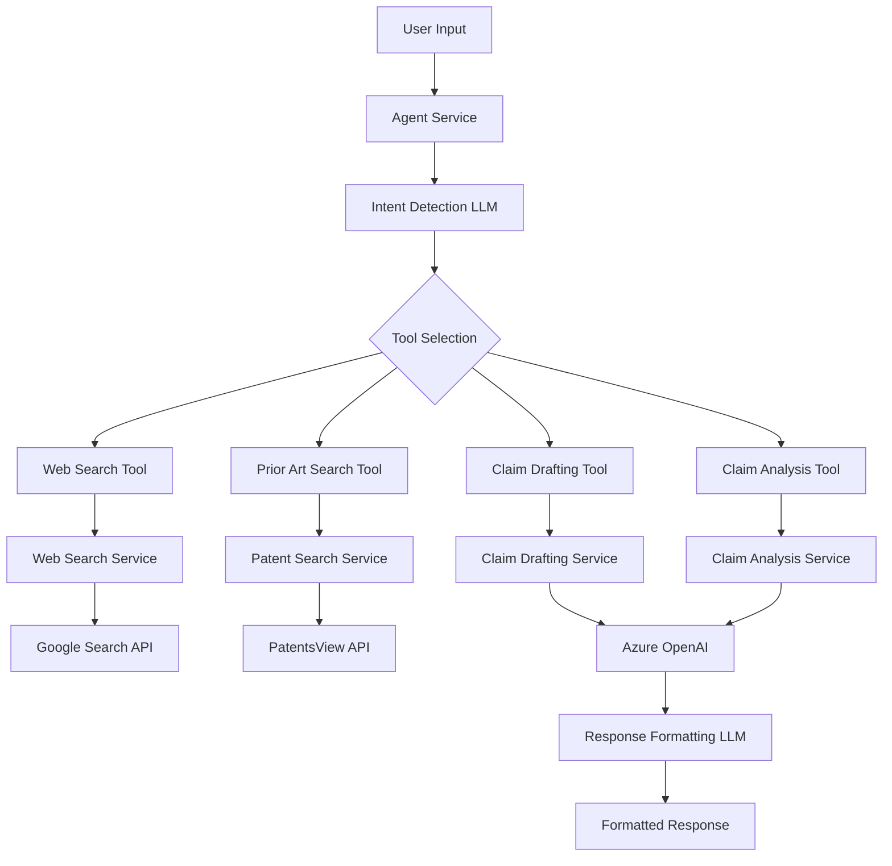
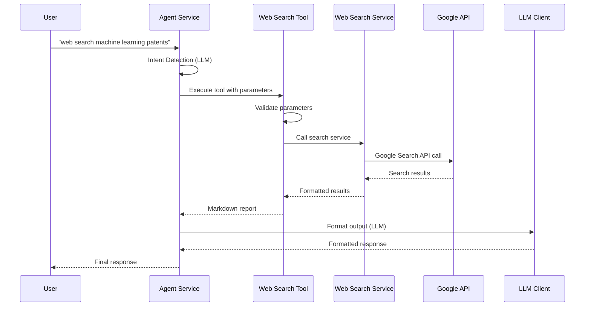
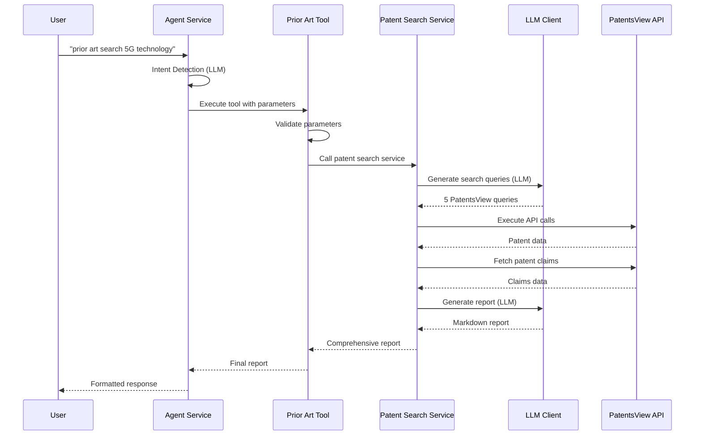
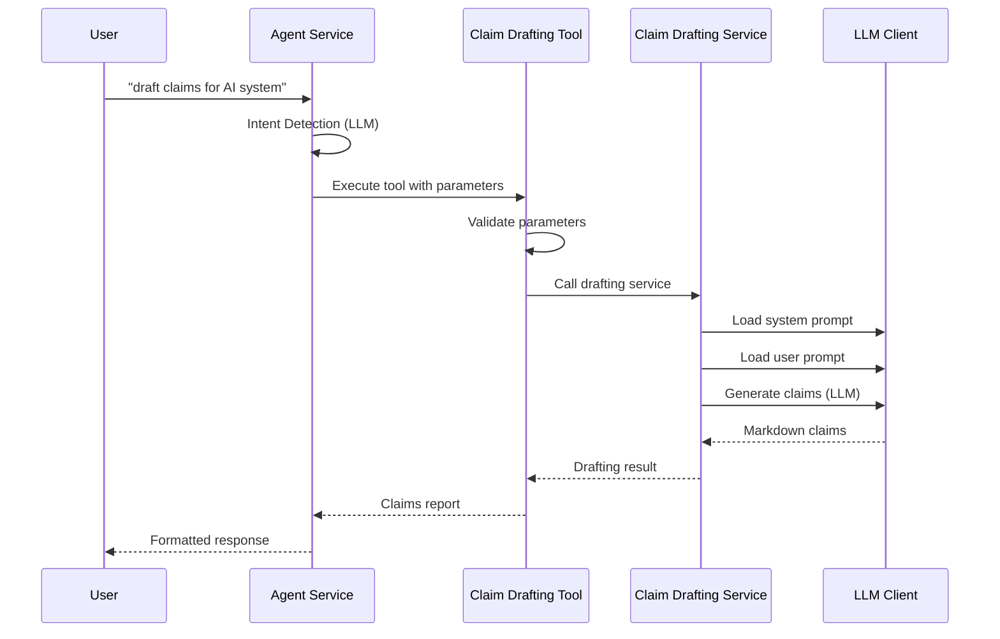
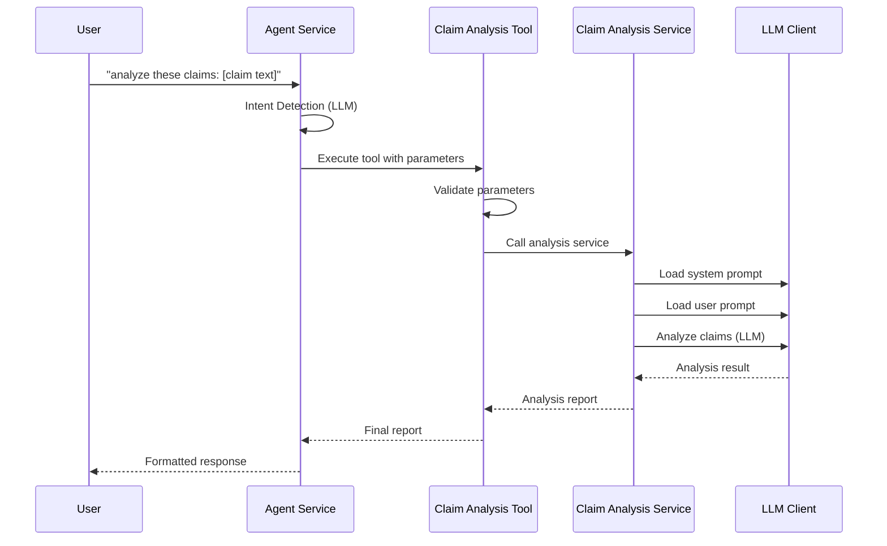
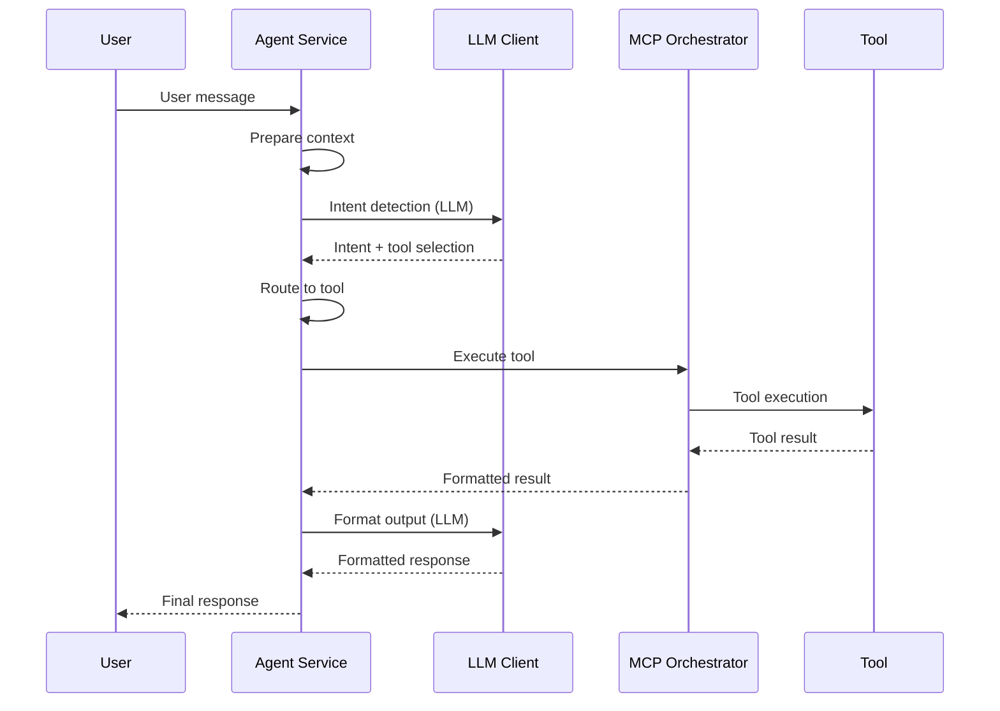

# End-to-End Tool Flow Documentation

This document provides comprehensive documentation for each MCP tool's end-to-end user flow, including functions, logic, prompts, and LLM usage.

## Table of Contents

1. [System Architecture Overview](#system-architecture-overview)
2. [Web Search Tool](#web-search-tool)
3. [Prior Art Search Tool](#prior-art-search-tool)
4. [Claim Drafting Tool](#claim-drafting-tool)
5. [Claim Analysis Tool](#claim-analysis-tool)
6. [Agent Service Flow](#agent-service-flow)
7. [Common Components](#common-components)

---

## System Architecture Overview



---

## Web Search Tool

### E2E User Flow



### Functions and Logic

#### 1. **Agent Service Intent Detection**
```python
# File: backend/app/services/agent.py
async def _llm_intent_detection(self, context: str, llm_client) -> Tuple[str, str, Dict[str, Any], str]:
    system_prompt = '''
    Analyze user input and determine whether to call a tool or provide a conversational response.
    
    IMPORTANT RULES:
    1. For web search requests like "web search [query]" or "search for [query]":
       - Extract the query after "web search" or "search for"
       - Use web_search_tool with {"query": "extracted_query"}
       - Example: "web search ramy Atawia" → {"action": "tool_call", "tool_name": "web_search_tool", "parameters": {"query": "ramy Atawia"}}
    '''
```

#### 2. **Web Search Tool Execution**
```python
# File: backend/app/mcp_servers/tools/web_search.py
async def execute(self, parameters: Dict[str, Any]) -> str:
    # 1. Parameter validation
    is_valid, error_message = await self.validate_parameters(parameters)
    
    # 2. Extract parameters
    query = parameters.get("query", "").strip()
    max_results = parameters.get("max_results", 10)
    
    # 3. Call Web Search Service
    async with WebSearchService() as search_service:
        search_results = await search_service.search_google(
            query=query, 
            max_results=max_results,
            include_abstracts=True
        )
    
    # 4. Format results as markdown
    result_text = f"# Web Search Results for: {query}\n\n"
    for i, result in enumerate(formatted_results, 1):
        result_text += f"## {i}. {result['title']}\n"
        result_text += f"**URL**: {result['url']}\n"
        result_text += f"**Snippet**: {result['snippet']}\n\n"
    
    return result_text
```

#### 3. **Web Search Service**
```python
# File: backend/app/services/web_search_service.py
async def search_google(self, query: str, max_results: int = 10) -> List[Dict[str, Any]]:
    # 1. Prepare Google Search API request
    search_params = {
        'key': self.api_key,
        'cx': self.search_engine_id,
        'q': query,
        'num': min(max_results, 10)
    }
    
    # 2. Make API call
    async with aiohttp.ClientSession() as session:
        async with session.get(self.search_url, params=search_params) as response:
            data = await response.json()
    
    # 3. Process and format results
    results = []
    for item in data.get('items', []):
        results.append({
            'title': item.get('title', ''),
            'link': item.get('link', ''),
            'snippet': item.get('snippet', ''),
            'displayLink': item.get('displayLink', ''),
            'source': 'Google Search',
            'type': 'web_page'
        })
    
    return results
```

### LLM Usage

- **Intent Detection**: Uses Azure OpenAI to determine if user wants web search
- **Response Formatting**: Uses LLM to format raw search results into user-friendly markdown

### Prompts

#### Intent Detection Prompt
```
Analyze user input and determine whether to call a tool or provide a conversational response.

IMPORTANT RULES:
1. For web search requests like "web search [query]" or "search for [query]":
   - Extract the query after "web search" or "search for"
   - Use web_search_tool with {"query": "extracted_query"}
   - Example: "web search ramy Atawia" → {"action": "tool_call", "tool_name": "web_search_tool", "parameters": {"query": "ramy Atawia"}}
```

#### Response Formatting Prompt
```
You are a helpful assistant that formats tool outputs into user-friendly responses.

Your task is to take raw tool output and format it into clean, readable markdown that answers the user's query.

Guidelines:
1. Parse and structure the data intelligently
2. Use proper markdown formatting (headings, lists, links, etc.)
3. Make the content easy to read and understand
4. Include relevant links and references
5. Focus on answering the user's specific question
6. If the data contains search results, format them as a structured list
7. Clean up any escaped characters or formatting issues
8. Keep the response concise but comprehensive
```

---

## Prior Art Search Tool

### E2E User Flow



### Functions and Logic

#### 1. **Prior Art Search Tool**
```python
# File: backend/app/mcp_servers/tools/prior_art_search.py
async def execute(self, parameters: Dict[str, Any]) -> str:
    # 1. Extract parameters
    query = parameters.get("query", "")
    context = parameters.get("context")
    conversation_history = parameters.get("conversation_history")
    max_results = parameters.get("max_results", 20)
    
    # 2. Execute patent search
    search_result, generated_queries = await self.patent_service.search_patents(
        query=query,
        context=context,
        conversation_history=conversation_history,
        max_results=max_results
    )
    
    # 3. Return markdown report
    return search_result["report"]
```

#### 2. **Patent Search Service**
```python
# File: backend/app/services/patent_search_service.py
async def search_patents(self, query: str, context: str = None, 
                        conversation_history: str = None, max_results: int = 20) -> Tuple[Dict, List]:
    # 1. Generate search queries using LLM
    search_queries = await self._generate_search_queries(query, context, conversation_history)
    
    # 2. Execute PatentsView API calls
    all_patents = []
    for search_query in search_queries:
        patents = await self._search_patents_view(search_query)
        all_patents.extend(patents)
    
    # 3. Fetch patent claims
    for patent in all_patents:
        claims = await self._fetch_claims(patent['patent_id'])
        patent['claims'] = claims
    
    # 4. Generate comprehensive report using LLM
    report = await self._generate_report(query, search_queries, all_patents)
    
    return {
        "query": query,
        "results_found": len(all_patents),
        "patents": all_patents,
        "report": report
    }, search_queries
```

#### 3. **Search Query Generation**
```python
async def _generate_search_queries(self, query: str, context: str = None, 
                                  conversation_history: str = None) -> List[Dict]:
    # Load prompt template
    system_prompt = load_prompt_template("patent_search_query_generation")
    user_prompt = load_prompt_template("prior_art_search_user",
                                      user_query=query,
                                      conversation_context=context or "",
                                      document_reference=conversation_history or "")
    
    # Generate queries using LLM
    response = self.llm_client.generate_text(
        prompt=user_prompt,
        system_message=system_prompt,
        max_tokens=2000
    )
    
    # Parse JSON response
    queries = json.loads(response["text"])
    return queries
```

### LLM Usage

1. **Search Query Generation**: Creates 5 different PatentsView API queries
2. **Report Generation**: Creates comprehensive markdown report
3. **Response Formatting**: Formats final output for user

### Prompts

#### Search Query Generation Prompt
```
You are a patent search expert. Generate 5 different PatentsView API search queries for the given invention.

For each query, provide:
- search_query: The actual PatentsView API query string
- reasoning: Why this query is relevant

Focus on different aspects:
1. Technical keywords
2. Inventor names
3. Assignee companies
4. Patent classification codes
5. Date ranges

User Query: {user_query}
Context: {conversation_context}
Document: {document_reference}
```

#### Report Generation Prompt
```
You are a patent attorney creating a comprehensive prior art search report.

Generate a detailed markdown report including:
1. Executive Summary
2. Search Strategy
3. Key Patents Found
4. Patent Landscape Analysis
5. Recommendations

Search Queries Used: {search_queries}
Patents Found: {patent_summaries}
```

---

## Claim Drafting Tool

### E2E User Flow



### Functions and Logic

#### 1. **Claim Drafting Tool**
```python
# File: backend/app/mcp_servers/tools/claim_drafting.py
async def execute(self, parameters: Dict[str, Any]) -> str:
    # 1. Extract and validate parameters
    user_query = parameters.get("user_query", "")
    conversation_context = parameters.get("conversation_context")
    document_reference = parameters.get("document_reference")
    
    if not user_query or len(user_query.strip()) < 3:
        return "Error: Invalid user query - must be at least 3 characters long"
    
    # 2. Call claim drafting service
    async with ClaimDraftingService() as drafting_service:
        drafting_result, generated_criteria = await drafting_service.draft_claims(
            user_query=user_query,
            conversation_context=conversation_context,
            document_reference=document_reference
        )
    
    # 3. Return markdown report
    return drafting_result["drafting_report"]
```

#### 2. **Claim Drafting Service**
```python
# File: backend/app/services/claim_drafting_service.py
async def draft_claims(self, user_query: str, conversation_context: Optional[str] = None, 
                      document_reference: Optional[str] = None) -> Tuple[Dict[str, Any], List[Dict[str, Any]]]:
    # 1. Load prompts
    system_prompt = self._load_system_prompt()
    user_prompt = self._load_user_prompt(user_query, conversation_context, document_reference)
    
    # 2. Generate claims using LLM
    claims_markdown = await self._draft_claims_with_llm_simple(
        user_query, conversation_context, document_reference
    )
    
    # 3. Create result
    result = {
        "user_query": user_query,
        "drafting_report": claims_markdown,
        "drafting_metadata": {
            "timestamp": datetime.now().isoformat()
        }
    }
    
    return result, []
```

#### 3. **LLM Claim Generation**
```python
async def _draft_claims_with_llm_simple(self, user_query: str, conversation_context: Optional[str], 
                                       document_reference: Optional[str]) -> str:
    # 1. Load prompts
    system_prompt = self._load_system_prompt()
    user_prompt = self._load_user_prompt(user_query, conversation_context, document_reference)
    
    # 2. Generate claims
    response_data = self.llm_client.generate_text(
        prompt=user_prompt,
        system_message=system_prompt,
        max_tokens=4000,
        temperature=0.3
    )
    
    # 3. Return generated claims
    return response_data.get("text", "")
```

### LLM Usage

1. **System Prompt**: Defines the role and output format
2. **User Prompt**: Provides context and specific instructions
3. **Claim Generation**: Creates patent claims in markdown format

### Prompts

#### System Prompt
```
You are a patent claim specialist. Generate high-quality patent claims in markdown format.

OUTPUT FORMAT:
Generate a markdown document with this structure:

# Patent Claims

## Claim 1 (Independent)
[Independent claim text describing the main invention with technical details]

## Claim 2 (Dependent)
The [system/method/apparatus] of claim 1, wherein [specific additional feature]

## Claim 3 (Dependent)
The [system/method/apparatus] of claim 1, further comprising [additional component]

[Continue with additional dependent claims as needed]

RULES:
- Use proper patent terminology (comprising, configured to, wherein, etc.)
- Make claims specific and technically detailed
- Ensure dependent claims properly reference their parent claims
- Focus on the novel and non-obvious aspects of the invention
- Use clear, unambiguous language
- Include technical details that make the invention unique
```

#### User Prompt
```
Draft patent claims for the following invention:

User Query: {user_query}

Conversation Context: {conversation_context}

Document Reference: {document_reference}

Please generate comprehensive patent claims that cover the invention described in the user query, taking into account any relevant context from the conversation and document.
```

---

## Claim Analysis Tool

### E2E User Flow



### Functions and Logic

#### 1. **Claim Analysis Tool**
```python
# File: backend/app/mcp_servers/tools/claim_analysis.py
async def execute(self, parameters: Dict[str, Any]) -> str:
    # 1. Extract and validate parameters
    claims = parameters.get("claims", [])
    analysis_type = parameters.get("analysis_type", "comprehensive")
    focus_areas = parameters.get("focus_areas", [])
    
    if not claims or not isinstance(claims, list):
        return "Error: Invalid claims input - claims must be a non-empty list"
    
    # 2. Call claim analysis service
    async with ClaimAnalysisService() as analysis_service:
        analysis_result, generated_criteria = await analysis_service.analyze_claims(
            claims=claims,
            analysis_type=analysis_type,
            focus_areas=focus_areas
        )
    
    # 3. Return markdown report
    return analysis_result["analysis_report"]
```

#### 2. **Claim Analysis Service**
```python
# File: backend/app/services/claim_analysis_service.py
async def analyze_claims(self, claims: List[Dict[str, Any]], analysis_type: str = "comprehensive",
                        focus_areas: Optional[List[str]] = None) -> Tuple[Dict[str, Any], List[Dict[str, Any]]]:
    # 1. Load prompts
    system_prompt = self._load_system_prompt()
    user_prompt = self._load_user_prompt(claims, analysis_type, focus_areas)
    
    # 2. Analyze claims using LLM
    analysis_result = await self._analyze_claims_with_llm(claims, analysis_type, focus_areas)
    
    # 3. Generate analysis report
    analysis_report = await self._generate_analysis_report(analysis_result, claims)
    
    # 4. Create result
    result = {
        "claims_analyzed": len(claims),
        "analysis_type": analysis_type,
        "analysis_report": analysis_report,
        "analysis_metadata": {
            "timestamp": datetime.now().isoformat(),
            "analysis_type": analysis_type,
            "focus_areas": focus_areas or []
        }
    }
    
    return result, []
```

### LLM Usage

1. **System Prompt**: Defines the role as a patent attorney
2. **User Prompt**: Provides claims and analysis requirements
3. **Analysis Generation**: Creates comprehensive claim analysis

### Prompts

#### System Prompt
```
You are a patent attorney analyzing patent claims for validity, quality, and improvement opportunities. Your expertise includes:

1. CLAIM STRUCTURE ANALYSIS:
   - Independent vs dependent claim relationships
   - Proper claim dependencies and numbering
   - Claim breadth and scope assessment

2. VALIDITY ASSESSMENT:
   - 35 USC 101 (subject matter eligibility)
   - 35 USC 112 (written description, enablement, definiteness)
   - 35 USC 103 (obviousness)
   - 35 USC 102 (novelty)

3. QUALITY EVALUATION:
   - Clarity and definiteness
   - Technical accuracy and specificity
   - Breadth vs. specificity balance
   - Defensibility and enforcement potential

4. IMPROVEMENT RECOMMENDATIONS:
   - Specific language improvements
   - Structural enhancements
   - Additional claim opportunities
   - Risk mitigation strategies

Provide comprehensive, actionable analysis that helps improve patent claim quality and validity.
```

#### User Prompt
```
Analyze the following patent claims for validity, quality, and improvement opportunities:

{claims_text}

Analysis Type: {analysis_type}
Focus Areas: {focus_areas}

Provide comprehensive analysis covering:
1. Claim structure and dependencies
2. Validity assessment (35 USC 101, 112, 103, 102)
3. Quality evaluation (clarity, breadth, defensibility)
4. Improvement recommendations
5. Risk assessment and mitigation strategies
```

---

## Agent Service Flow

### E2E User Flow



### Functions and Logic

#### 1. **Main Processing Flow**
```python
# File: backend/app/services/agent.py
async def process_user_message(self, user_message: str, document_content: Optional[str] = None,
                              available_tools: List[Dict[str, Any]] = None,
                              frontend_chat_history: List[Dict[str, Any]] = None) -> Dict[str, Any]:
    # 1. Prepare context
    context = self._prepare_context(user_message, conversation_history, document_content, available_tools)
    
    # 2. Detect intent and route
    action_result = await self.detect_intent_and_route(
        user_input=user_message,
        conversation_history=conversation_history,
        document_content=document_content,
        available_tools=available_tools
    )
    
    # 3. Execute tool or provide conversation
    if intent_type == "tool_execution":
        execution_result = await orchestrator.execute_tool(tool_name, parameters)
        final_response = await self.format_tool_output_with_llm(execution_result, user_message, tool_name)
    else:
        final_response = reasoning
    
    return {
        "response": final_response,
        "tools_used": tools_used,
        "execution_result": execution_result
    }
```

#### 2. **Intent Detection**
```python
async def _llm_intent_detection(self, context: str, llm_client) -> Tuple[str, str, Dict[str, Any], str]:
    system_prompt = '''
    Analyze user input and determine whether to call a tool or provide a conversational response.
    
    IMPORTANT RULES:
    1. For web search requests like "web search [query]" or "search for [query]":
       - Extract the query after "web search" or "search for"
       - Use web_search_tool with {"query": "extracted_query"}
    
    2. For prior art search or patent search:
       - Use prior_art_search_tool with the invention/technology as query
    
    3. For claim drafting:
       - Use claim_drafting_tool with user query, conversation context, and document reference
       - ALWAYS include the document content in document_reference parameter
       - ALWAYS include conversation history in conversation_context parameter
    
    Respond with JSON in one of two formats:
    
    Tool Call:
    {"action": "tool_call", "tool_name": "tool_name", "parameters": {...}}
    
    Conversation:
    {"action": "conversation", "response": "conversational response"}
    '''
    
    # Call LLM
    result = llm_client.generate_text(
        prompt=context,
        system_message=system_prompt,
        max_tokens=1000,
        temperature=0.3
    )
    
    # Parse JSON response
    response_data = json.loads(result["text"])
    return response_data["action"], response_data.get("tool_name"), response_data.get("parameters"), response_data.get("response")
```

#### 3. **Response Formatting**
```python
async def format_tool_output_with_llm(self, tool_output: Any, user_query: str, tool_name: str = None) -> str:
    system_prompt = f"""You are a helpful assistant that formats tool outputs into user-friendly responses.

Your task is to take raw tool output and format it into clean, readable markdown that answers the user's query.

Guidelines:
1. Parse and structure the data intelligently
2. Use proper markdown formatting (headings, lists, links, etc.)
3. Make the content easy to read and understand
4. Include relevant links and references
5. Focus on answering the user's specific question
6. If the data contains search results, format them as a structured list
7. Clean up any escaped characters or formatting issues
8. Keep the response concise but comprehensive

Tool used: {tool_name or 'Unknown tool'}
User query: {user_query}

Format the following tool output into a clean, user-friendly response:"""

    user_prompt = f"""Please format this tool output to answer the user's query: "{user_query}"

Tool Output:
{tool_output_str}

Provide a well-formatted markdown response that directly answers the user's question."""

    # Call LLM
    result = llm_client.generate_text(
        prompt=user_prompt,
        max_tokens=16000,
        temperature=0.3,
        system_message=system_prompt
    )
    
    return result["text"]
```

---

## Common Components

### LLM Client

The LLM Client provides a unified interface for all Azure OpenAI interactions:

```python
# File: backend/app/services/llm_client.py
class LLMClient:
    def generate_text(self, prompt: str, max_tokens: int = 1000, 
                     temperature: float = 0.7, system_message: Optional[str] = None, 
                     max_retries: int = 3) -> Dict[str, Any]:
        # 1. Prepare messages
        messages = []
        if system_message:
            messages.append({"role": "system", "content": system_message})
        messages.append({"role": "user", "content": prompt})
        
        # 2. Make API call with retry logic
        for attempt in range(max_retries):
            try:
                response = self.client.chat.completions.create(
                    model=self.azure_openai_deployment,
                    messages=messages,
                    max_tokens=max_tokens,
                    temperature=temperature
                )
                break
            except Exception as e:
                if attempt < max_retries - 1:
                    time.sleep(2 ** attempt)  # Exponential backoff
                else:
                    raise e
        
        # 3. Return formatted response
        return {
            "success": True,
            "text": response.choices[0].message.content,
            "usage": {
                "prompt_tokens": response.usage.prompt_tokens,
                "completion_tokens": response.usage.completion_tokens,
                "total_tokens": response.usage.total_tokens
            }
        }
```

### MCP Orchestrator

The MCP Orchestrator coordinates all tool executions:

```python
# File: backend/app/services/mcp/orchestrator.py
class MCPOrchestrator:
    async def execute_tool(self, tool_name: str, parameters: Dict[str, Any]) -> Dict[str, Any]:
        # 1. Validate parameters
        is_valid, errors = await self.execution_engine.validate_parameters(tool_name, parameters)
        if not is_valid:
            raise ValidationError(f"Invalid parameters for tool '{tool_name}': {errors}")
        
        # 2. Execute tool through server registry
        result = await self.server_registry.execute_tool(tool_name, parameters)
        
        # 3. Format result
        formatted_result = await self.execution_engine.format_result(result, tool_name)
        
        return formatted_result
```

### Error Handling

All tools implement comprehensive error handling:

1. **Parameter Validation**: Check input parameters before processing
2. **LLM Error Handling**: Retry logic with exponential backoff
3. **Service Error Handling**: Graceful fallbacks for service failures
4. **Response Validation**: Ensure output quality and format

### Logging

Comprehensive logging throughout the system:

1. **Debug Logging**: Detailed execution flow
2. **Error Logging**: Exception details and context
3. **Performance Logging**: Execution times and resource usage
4. **User Activity Logging**: Tool usage and user interactions

---

## Summary

This documentation provides a complete overview of the E2E user flows for all MCP tools. Each tool follows a consistent pattern:

1. **User Input** → **Agent Service** → **Intent Detection** → **Tool Selection**
2. **Tool Execution** → **Service Layer** → **LLM Processing** → **Response Generation**
3. **Response Formatting** → **Final Output** → **User**

The system is designed to be robust, scalable, and user-friendly, with comprehensive error handling and logging throughout.
